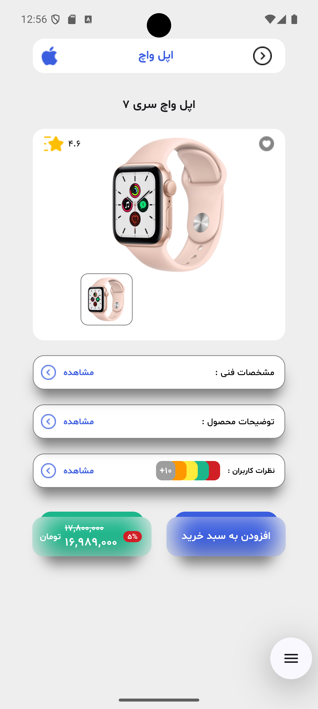
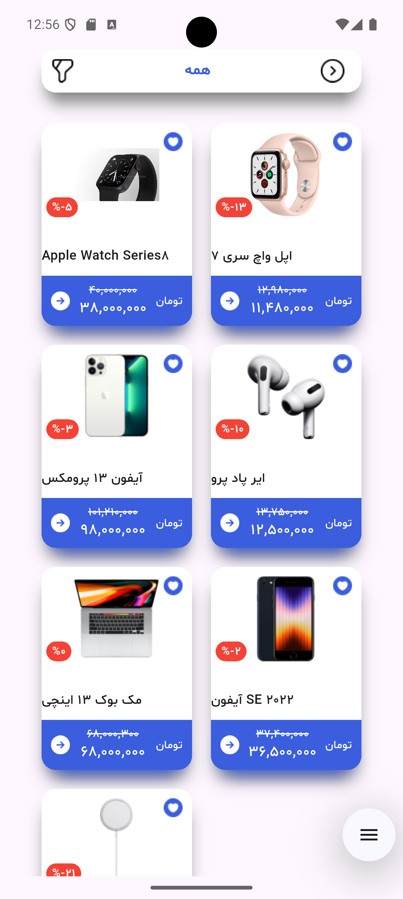
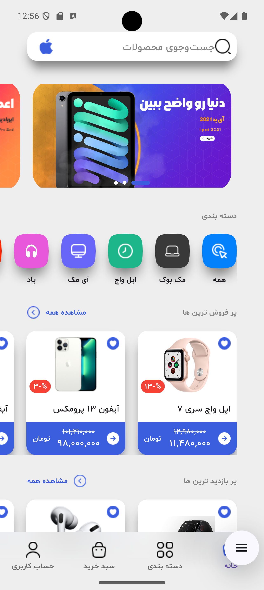
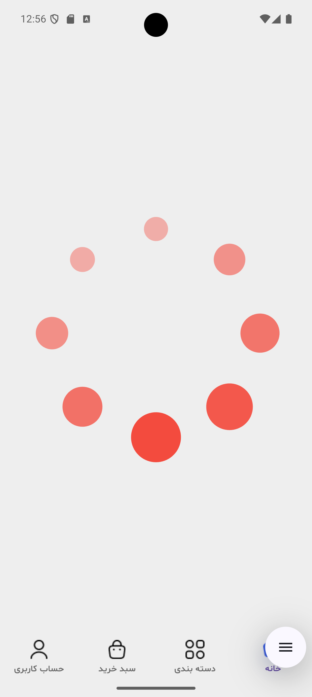
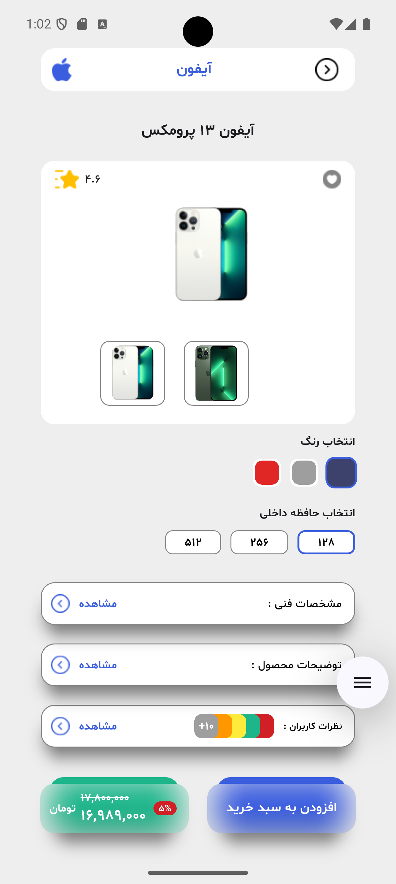
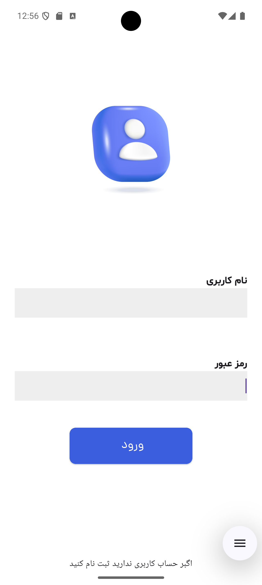
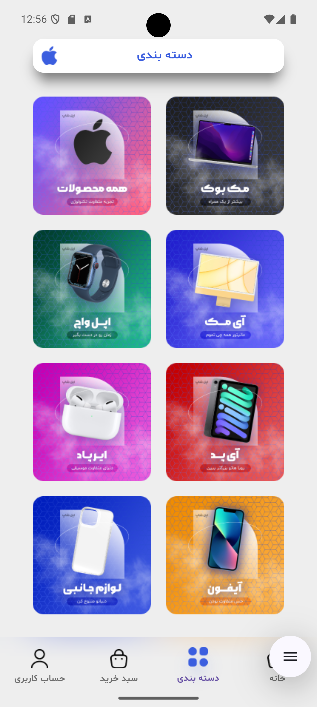
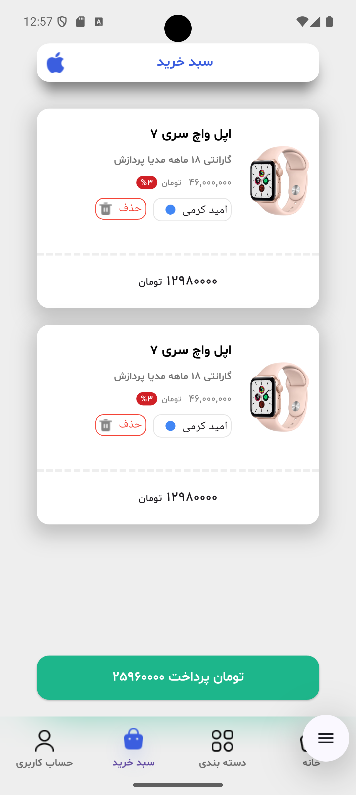
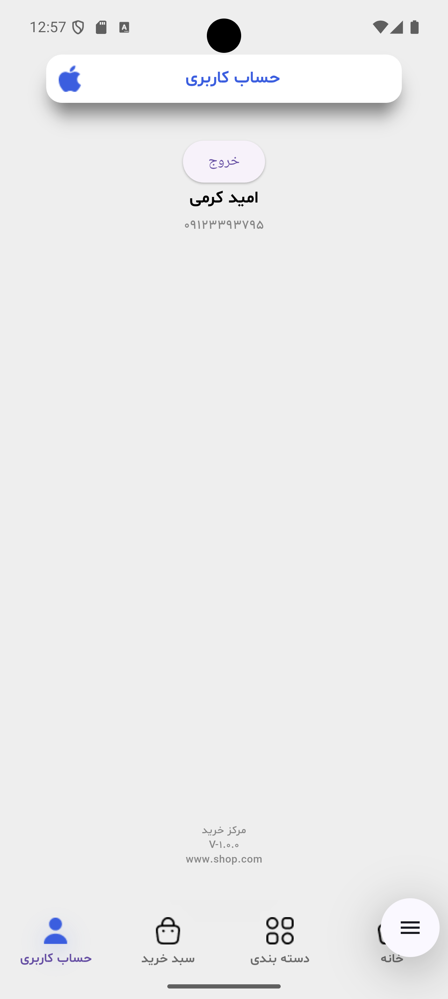
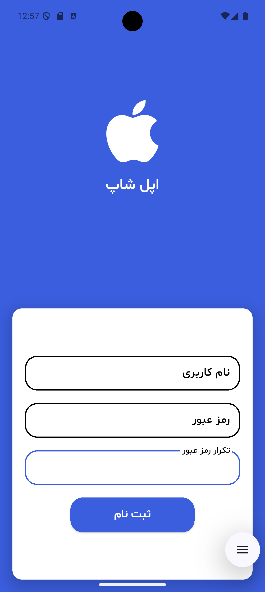

# shop
- Use expert flutter Api
- Use Dio 
- Use bloc
- Use clean arc
- Use Smooth Indicator 
- Use dotted_line
- Use Cache Network Image 
- Use dartz
- Use get_it
- Use hive
- Use zarinpal
- Use url_launcher
- Use app_links
- Use Shared Preferences  
       
  

